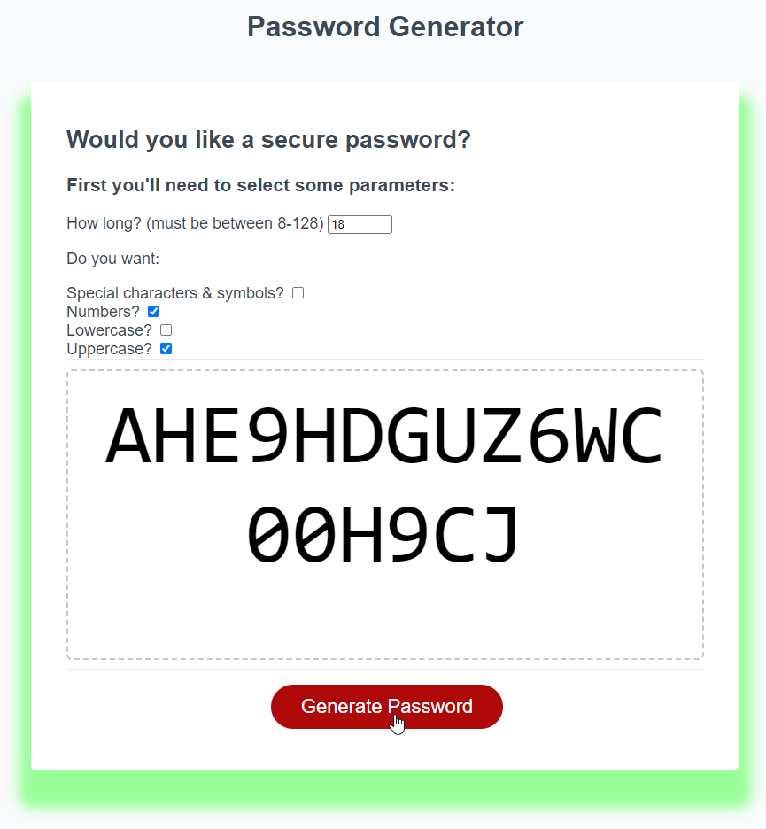

# 03-Challenge-PasswordGenerator
# Submitted by Conor Donnelly - September 19, 2022

This challenge required us to write code using JavaScript to produce a secure random 
password generator based on criteria provided by user input. Validation was needed to ensure
the correct password length (8 - 128) characters was selected by the user. The parameter strings needed to be assembled on the fly based on criteria selected using checkbox inputs, then Math.floor() and Math.random() methods were used to randomly select the correct number of characters using a While loop.

Some HTML and CSS edits were also necessary in order to create a responsive design that looks good on various sized displays.

## Page URL
(https://riversidempls.github.io/03-Challenge-PasswordGen/)

## Screenshot

